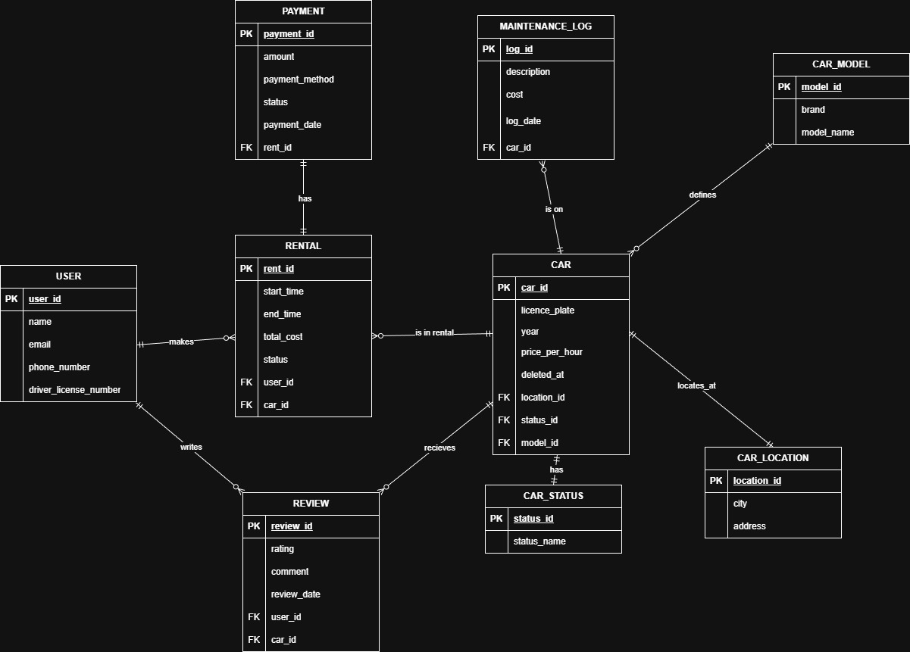

# README report

**до курсової роботи з дисципліни "Бази даних"**

**Тема:** Розробка інформаційної системи для сервісу CarSharing

## ЗМІСТ

1.  Вступ
2.  Аналіз предметної області та вимоги до системи
3.  Проєктування бази даних
4.  Реалізація системи
5.  Тестування
6.  Висновки

---

## ВСТУП

Автоматизація процесів оренди автомобілів (каршерінгу) є актуальним завданням в умовах сучасного міста. Такі сервіси працюють з великою кількістю користувачів та обмеженою кількістю ресурсів — автомобілів, тому особливо важливо забезпечити коректну обробку даних і уникнути помилок, пов’язаних з одночасним доступом.

Основною проблемою є ситуації, коли декілька користувачів одночасно намагаються орендувати один і той самий автомобіль, а також необхідність збереження історії оренд і фінансових операцій. Саме тому ключову роль у системі відіграє правильно спроєктована база даних.

Метою курсової роботи є проєктування та розробка серверної частини інформаційної системи каршерінгу з використанням реляційної бази даних.

**Основні завдання:**

* Спроєктувати реляційну базу даних у третій нормальній формі (3НФ).
* Реалізувати механізм забезпечення цілісності даних при паралельному доступі (транзакції).
* Розробити підсистему аналітичної звітності.
* Забезпечити надійне зберігання історії змін за допомогою механізму soft delete.

**Технологічний стек:**

* **Мова програмування:** TypeScript (Node.js)
* **СКБД:** PostgreSQL
* **ORM:** Prisma (підхід Code First)
* **Середовище виконання:** Docker Compose
* **Тестування:** Jest

---

## РОЗДІЛ 1. АНАЛІЗ ПРЕДМЕТНОЇ ОБЛАСТІ ТА ВИМОГИ ДО СИСТЕМИ

### 1.1. Опис бізнес-процесів

Розроблена система автоматизує основні бізнес-процеси сервісу каршерінгу:

1.  **Реєстрація та зберігання даних користувачів.**
    Система зберігає персональні та контактні дані користувачів. Поля `email` та `driver_license_number` є унікальними, що унеможливлює створення дубльованих акаунтів.
2.  **Управління автопарком.**
    Адміністратор може додавати нові автомобілі, вказуючи їх модель, локацію та статус. При видаленні автомобіля з активного використання дані не видаляються фізично, а позначаються як неактивні.
3.  **Оренда автомобіля.**
    Користувач може орендувати автомобіль лише у випадку, якщо він має статус доступного. Під час створення оренди автомобіль блокується для інших користувачів.
4.  **Завершення оренди та оплата.**
    Після завершення оренди обчислюється загальна вартість на основі часу використання та погодинного тарифу автомобіля, після чого фіксується факт оплати.

### 1.2. Функціональні вимоги

Система повинна відповідати принципам ACID. Особлива увага приділяється обробці ситуацій типу *race condition*, коли декілька користувачів одночасно виконують операції над одними й тими самими даними.

---

## РОЗДІЛ 2. ПРОЄКТУВАННЯ БАЗИ ДАНИХ

### 2.1. Вибір СУБД

Для реалізації бази даних інформаційної системи каршерінгу обрано PostgreSQL. Дана система управління базами даних підтримує транзакції, зовнішні ключі, обмеження цілісності та відповідає вимогам ACID, що є критично важливим для коректної обробки операцій оренди автомобілів та фінансових даних.

### 2.2. Інфологічне проєктування та нормалізація

Інфологічна модель бази даних була розроблена на основі аналізу предметної області сервісу каршерінгу. Проєктування виконано з дотриманням вимог третьої нормальної форми (3НФ). Повторювані та довідникові дані винесені в окремі таблиці, що дозволяє зменшити надлишковість інформації та уникнути аномалій оновлення.

На рисунку нижче наведено ER-діаграму бази даних, яка відображає основні сутності системи та зв’язки між ними.



**Основні сутності бази даних:**

* **User** — зберігає персональні дані користувачів системи, включаючи контактну інформацію та номер водійського посвідчення.
* **Car** — містить інформацію про автомобілі, доступні для оренди, включаючи вартість, модель, локацію, статус та ознаку м’якого видалення.
* **CarModel** — довідкова таблиця, що описує бренд і модель автомобіля.
* **CarLocation** — довідник місць розташування автомобілів (місто та адреса).
* **CarStatus** — визначає поточний стан автомобіля (доступний, в оренді, на обслуговуванні тощо).
* **Rental** — фіксує факт оренди автомобіля конкретним користувачем, включаючи часові рамки та підсумкову вартість.
* **Payment** — зберігає інформацію про оплату оренд, включаючи суму, метод та статус платежу.
* **Review** — дозволяє користувачам залишати відгуки та оцінки автомобілів.
* **MaintenanceLog** — журнал технічного обслуговування та ремонтів автомобілів.

Усі зв’язки між таблицями реалізовані за допомогою зовнішніх ключів, що забезпечує референтну цілісність даних.

### 2.3. Даталогічна модель (SQL)

Нижче наведено основні SQL-скрипти створення таблиць бази даних, які відповідають інфологічній моделі та ER-діаграмі.

**Таблиця користувачів (User):**

```sql
CREATE TABLE "User" (
  "user_id" SERIAL PRIMARY KEY,
  "name" TEXT NOT NULL,
  "email" TEXT NOT NULL UNIQUE,
  "phone_number" TEXT NOT NULL,
  "driver_license_number" TEXT NOT NULL UNIQUE
);
```

**Таблиця моделей автомобілів (CarModel):**

```sql
CREATE TABLE "CarModel" (
  "model_id" SERIAL PRIMARY KEY,
  "brand" TEXT NOT NULL,
  "model_name" TEXT NOT NULL
);
```

**Таблиця локацій автомобілів (CarLocation):**

```sql
CREATE TABLE "CarLocation" (
  "location_id" SERIAL PRIMARY KEY,
  "city" TEXT NOT NULL,
  "address" TEXT NOT NULL
);
```

**Таблиця статусів автомобілів (CarStatus):**

```sql
CREATE TABLE "CarStatus" (
  "status_id" SERIAL PRIMARY KEY,
  "status_name" TEXT NOT NULL
);
```

**Таблиця автомобілів (Car):**

```sql
CREATE TABLE "Car" (
  "car_id" SERIAL PRIMARY KEY,
  "license_plate" TEXT NOT NULL UNIQUE,
  "year" INTEGER,
  "price_per_hour" DECIMAL(10,2) NOT NULL,
  "deleted_at" TIMESTAMP,
  "location_id" INTEGER NOT NULL,
  "status_id" INTEGER NOT NULL,
  "model_id" INTEGER NOT NULL,
  FOREIGN KEY ("location_id") REFERENCES "CarLocation"("location_id"),
  FOREIGN KEY ("status_id") REFERENCES "CarStatus"("status_id"),
  FOREIGN KEY ("model_id") REFERENCES "CarModel"("model_id")
);
```

**Таблиця оренд (Rental):**

```sql
CREATE TABLE "Rental" (
  "rent_id" SERIAL PRIMARY KEY,
  "start_time" TIMESTAMP NOT NULL DEFAULT CURRENT_TIMESTAMP,
  "end_time" TIMESTAMP,
  "total_cost" DECIMAL(10,2),
  "status" TEXT NOT NULL,
  "user_id" INTEGER NOT NULL,
  "car_id" INTEGER NOT NULL,
  FOREIGN KEY ("user_id") REFERENCES "User"("user_id"),
  FOREIGN KEY ("car_id") REFERENCES "Car"("car_id")
);
```

**Таблиця платежів (Payment):**

```sql
CREATE TABLE "Payment" (
  "payment_id" SERIAL PRIMARY KEY,
  "amount" DECIMAL(10,2) NOT NULL,
  "payment_method" TEXT NOT NULL,
  "status" TEXT NOT NULL,
  "payment_date" TIMESTAMP NOT NULL DEFAULT CURRENT_TIMESTAMP,
  "rent_id" INTEGER NOT NULL UNIQUE,
  FOREIGN KEY ("rent_id") REFERENCES "Rental"("rent_id")
);
```

**Таблиця відгуків (Review):**

```sql
CREATE TABLE "Review" (
  "review_id" SERIAL PRIMARY KEY,
  "rating" INTEGER NOT NULL,
  "comment" TEXT,
  "review_date" TIMESTAMP NOT NULL DEFAULT CURRENT_TIMESTAMP,
  "user_id" INTEGER NOT NULL,
  "car_id" INTEGER NOT NULL,
  FOREIGN KEY ("user_id") REFERENCES "User"("user_id"),
  FOREIGN KEY ("car_id") REFERENCES "Car"("car_id")
);
```

**Таблиця журналу обслуговування (MaintenanceLog):**

```sql
CREATE TABLE "MaintenanceLog" (
  "log_id" SERIAL PRIMARY KEY,
  "description" TEXT NOT NULL,
  "cost" DECIMAL(10,2) NOT NULL,
  "log_date" TIMESTAMP NOT NULL DEFAULT CURRENT_TIMESTAMP,
  "car_id" INTEGER NOT NULL,
  FOREIGN KEY ("car_id") REFERENCES "Car"("car_id")
);
```

## РОЗДІЛ 3. РЕАЛІЗАЦІЯ СИСТЕМИ

Архітектура серверної частини застосунку побудована за шаровим принципом. Бізнес-логіка зосереджена у сервісному шарі (Service Layer), а взаємодія з базою даних здійснюється через ORM Prisma, що забезпечує типобезпечний доступ до даних та підтримку транзакцій.

### 3.1. Реалізація транзакцій (атомарність оренди)

Операція оренди автомобіля є критичною з точки зору цілісності даних, оскільки складається з декількох взаємопов’язаних дій. Зокрема, необхідно створити запис про оренду та одночасно змінити статус автомобіля на «в оренді». Для запобігання станам гонки (race condition) ці дії виконуються в межах однієї транзакції.

Дана логіка реалізована у сервісному методі оренди автомобіля (`файл: src/services/rental.service.ts`).

**Реалізація у коді (TypeScript, Prisma):**

```typescript
const result = await prisma.$transaction(async (tx) => {
  const newRental = await tx.rental.create({
    data: {
      user_id: userId,
      car_id: carId,
      start_time: new Date(),
      status: 'Active'
    }
  })

  await tx.car.update({
    where: { car_id: carId },
    data: { status_id: rentedStatus!.status_id }
  })

  return newRental
})
```

У разі виникнення помилки на будь-якому з етапів транзакція буде повністю скасована, що гарантує атомарність операції та збереження узгодженого стану бази даних.

**Еквівалентний SQL-сценарій:**

```sql
BEGIN;

INSERT INTO "Rental" ("user_id", "car_id", "start_time", "status")
VALUES (1, 5, NOW(), 'Active');

UPDATE "Car"
SET "status_id" = (
  SELECT "status_id"
  FROM "CarStatus"
  WHERE "status_name" = 'Rented'
)
WHERE "car_id" = 5;

COMMIT;
```

### 3.2. Реалізація механізму Soft Delete

Фізичне видалення автомобілів з бази даних не використовується, оскільки це призводить до втрати історичних даних про оренди та фінансові операції. Для вирішення цієї проблеми застосовується механізм м’якого видалення (Soft Delete), який реалізовано через поле `deleted_at`.

Логіка м’якого видалення реалізована у сервісі управління автомобілями (`файл: src/services/car.service.ts`).

**Реалізація у коді (TypeScript, Prisma):**

```typescript
await prisma.car.update({
  where: { car_id: carId },
  data: { deleted_at: new Date() }
})
```

Під час вибірки даних система автоматично виключає записи, позначені як видалені.

**Еквівалентний SQL-запит:**

```sql
SELECT *
FROM "Car"
WHERE "deleted_at" IS NULL;
```

### 3.3. Аналітичні запити та формування звітів

Для аналізу ефективності роботи сервісу каршерінгу в системі реалізовано підсистему аналітичної звітності. Вона використовує агрегатні функції бази даних для отримання узагальненої статистики.

Аналітична логіка зосереджена в окремому сервісі (`файл: src/services/stats.service.ts`).

**Реалізація у коді (TypeScript, Prisma):**

```typescript
const topCars = await prisma.rental.groupBy({
  by: ['car_id'],
  _sum: {
    total_cost: true
  },
  where: {
    status: 'Finished'
  },
  orderBy: {
    _sum: {
      total_cost: 'desc'
    }
  },
  take: 5
})
```

Запит дозволяє визначити п’ять автомобілів, які принесли найбільший сумарний дохід за весь період експлуатації.

**Еквівалентний SQL-запит:**

```sql
SELECT "car_id", SUM("total_cost") AS total_revenue
FROM "Rental"
WHERE "status" = 'Finished'
GROUP BY "car_id"
ORDER BY total_revenue DESC
LIMIT 5;
```

### 3.4. Структура проєкту

Проєкт організовано відповідно до принципів чистої архітектури, що забезпечує легку масштабованість та підтримку коду.

```text
src/
├── controllers/      # Обробка HTTP-запитів та взаємодія з користувачем (CLI)
├── services/         # Бізнес-логіка (перевірка доступності, розрахунок ціни)
├── generated/        # Автозгенерований клієнт Prisma ORM
├── utils/            # Допоміжні утиліти (Input scanner)
└── index.ts          # Точка входу в додаток
```

### 3.5. Інструкція з розгортання та запуску

Для забезпечення відтворюваності середовища використовуються Docker та NPM.

**1. Встановлення залежностей:**

```bash
npm install
```

**2. Запуск бази даних (Docker):**

```bash
docker-compose up -d
```

**3. Виконання міграцій (створення таблиць):**

```bash
npx prisma migrate dev --name init
```

**4. Запуск додатку:**

```bash
npm start
```

## РОЗДІЛ 4. ТЕСТУВАННЯ

Для перевірки коректності роботи системи використано інтеграційне тестування з бібліотекою Jest. Тести перевіряють створення оренд, зміну статусів автомобілів та обробку помилкових сценаріїв, зокрема спробу повторної оренди зайнятого автомобіля.

**Команда для запуску тестів:**

```bash
npm test
```

Система автоматично підготує тестову базу даних, виконає сценарії та виведе звіт про результати.
---

## ВИСНОВКИ

У ході виконання курсової роботи було спроєктовано та реалізовано серверну частину інформаційної системи для сервісу каршерінгу.

**Основні результати роботи:**

* Спроєктовано базу даних у третій нормальній формі, що забезпечує відсутність надлишковості даних.
* Реалізовано транзакційну логіку для критичних операцій (оренда, повернення), що гарантує цілісність даних.
* Впроваджено механізм soft delete, що дозволяє зберігати історію навіть після видалення об'єктів адміністратором.
* Реалізовано систему аналітичних звітів на базі агрегатних функцій SQL.

